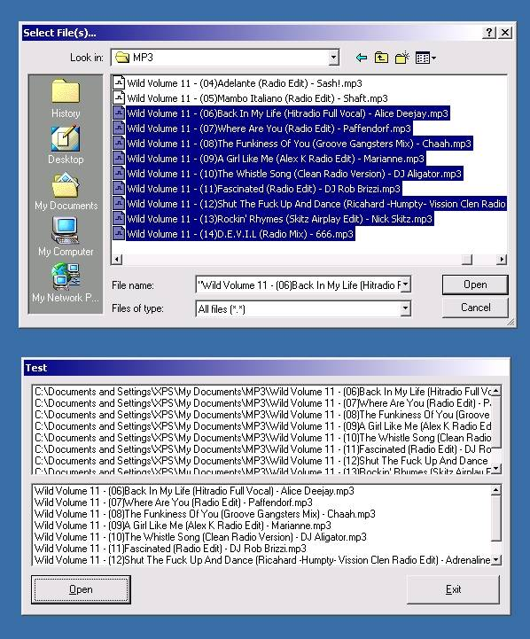



## CommonDialog Multi Select \- Must Have Code

### Description

Update of my old code, does the samething just explained

Also Demain Net riped my code and put it in there program u can see this because my post was done before they updated there

U can get my old code here

http://www.planet-source-code.com/xq/ASP/txtCodeId.12096/lngWId.1/qx/vb/scripts/ShowCode.htm

This code is a must for people making mp3 players etc everyone should have this code

Tip: Make your CommonDialog Box max file size "9999"

If you think this code is good (and it is) please vote for me
 
### More Info
 

             |
---                |---
**Submitted On**   |2000-10-18 15:46:26
**By**             |[\-=XPS=\-](https://github.com/Planet-Source-Code/PSCIndex/blob/master/ByAuthor/xps.md)
**Level**          |Beginner
**User Rating**    |4.2 (54 globes from 13 users)
**Compatibility**  |VB 5\.0, VB 6\.0
**Category**       |[Files/ File Controls/ Input/ Output](https://github.com/Planet-Source-Code/PSCIndex/blob/master/ByCategory/files-file-controls-input-output__1-3.md)
**World**          |[Visual Basic](https://github.com/Planet-Source-Code/PSCIndex/blob/master/ByWorld/visual-basic.md)
**Archive File**   |[CODE\_UPLOAD1073110172000\.zip](https://github.com/Planet-Source-Code/xps-commondialog-multi-select-must-have-code__1-12114/archive/master.zip)

